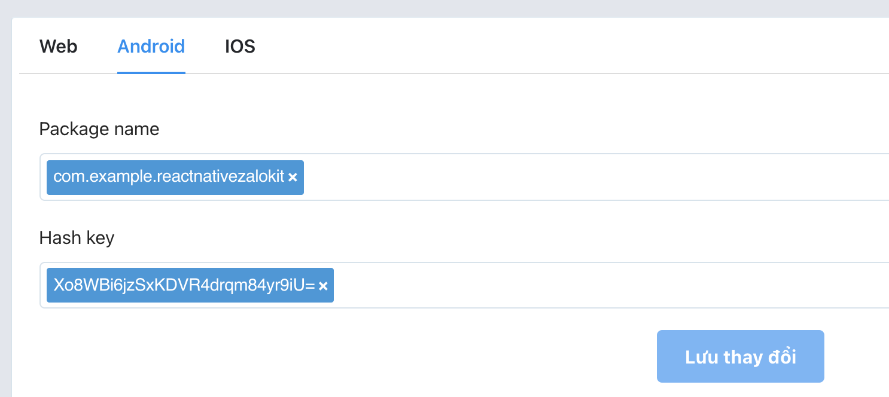
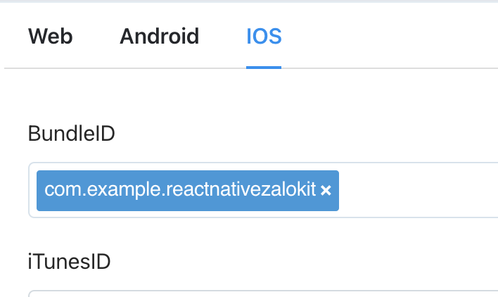
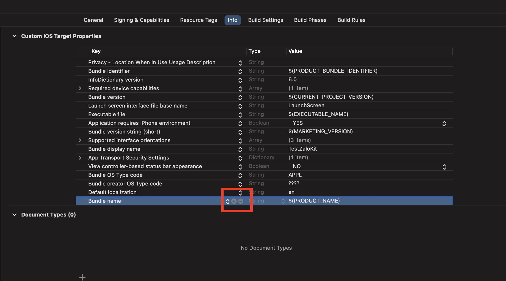
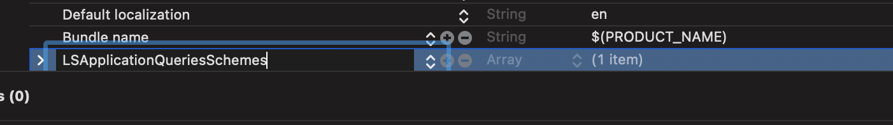
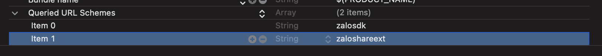
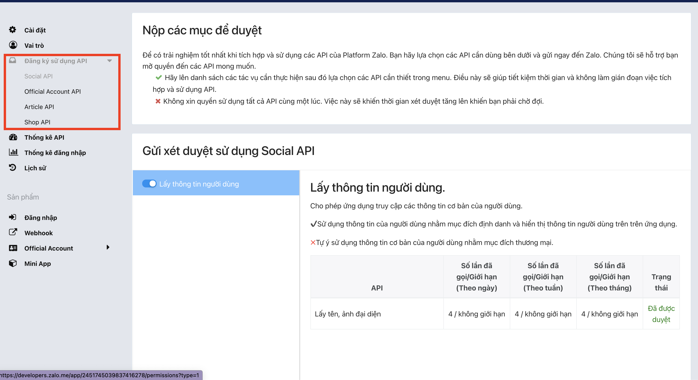

<h1 align="center">
  <div>
    
    
  </div>
  
  Zalo SDK for React Native
  <div>
  

  

  

  
  </div>
</h1>

<div align="center">
  
  
</div>

# Table of Contents

- [Installation](#installation)
- [Supported APIs](#supported-apis)
- [Setup](#setup)
   * [Create Zalo Application](#create-zalo-application)
   * [React Native CLI Project](#react-native-cli-project)
      + [iOS](#ios)
      + [Android](#android)
   * [Expo](#expo)
- [Usage](#usage)
   * [Login](#login)
   * [Check if authenticated](#check-if-authenticated)
   * [Get User Profile](#get-user-profile)
   * [Logout](#logout)
- [Troubleshooting](#troubleshooting)
- [Demo](#demo)
- [Thank you](#thank-you)

# Installation
With npm:
`$ npm install react-native-zalo-kit`

With yarn:
`$ yarn add react-native-zalo-kit`

After that:
```
cd ios && pod install

cd android && ./gradlew generateCodegenArtifactsFromSchema
```

# Supported APIs
Below is list of supported APIs:

- [x] Login
- [x] isAuthenticated
- [x] getUserProfile
- [x] logout

See more here:
- iOS: https://developers.zalo.me/docs/sdk/ios-sdk/references/ma-loi
- Android: https://developers.zalo.me/docs/sdk/android-sdk/tong-quan

# Setup
## Create Zalo Application
First of all you need to create Zalo application on [Zalo Developer Portal](https://developers.zalo.me/)

> Note: when setting up Android platform for your application, it'll ask you for a `Hash key`. We provide you a helper function to [get that key](#get-application-hash-key-android-only)

Next, go to `Sản phẩm>Đăng nhập` and configure for Android and iOS:

<div align="center">
  
  
</div>

> Enter your app package name, hash key, and bundle ID

After that you'll get your Zalo App Key, and you'll need to use it for next sections

**Note 1**: you're recommended to turn your Zalo app to `Live Mode` in order to get full functionalities.

## React Native CLI Project
### iOS
Run the following command to setup for iOS:
```
npx pod-install ios
```

After that, open `ios/<your_app_name>/AppDelegate.mm` (or .swift), and add the following:
```objc
#import <ZaloSDK/ZaloSDK.h>

- (BOOL)application:(UIApplication *)application
 didFinishLaunchingWithOptions:(NSDictionary *)launchOptions {
    ...

    [[ZaloSDK sharedInstance] initializeWithAppId:@"<YOUR_ZALO_APP_ID>"];
    
    return [super application:application didFinishLaunchingWithOptions:launchOptions];
}

...  

- (BOOL)application:(UIApplication *)application openURL:(nonnull NSURL *)url options:(nonnull NSDictionary<NSString *,id> *)options {
  return [[ZDKApplicationDelegate sharedInstance] application:application openURL:url options:options];
}
```

Swift:
```swift
import ZaloSDK

@main
class AppDelegate: UIResponder, UIApplicationDelegate {

  func application(
    _ application: UIApplication,
    didFinishLaunchingWithOptions launchOptions: [UIApplication.LaunchOptionsKey: Any]? = nil
  ) -> Bool {
    // ...
    
    ZaloSDK.sharedInstance().initialize(withAppId: "app_id")

    return true
  }
  
  func application(_ app: UIApplication, open url: URL, options: [UIApplication.OpenURLOptionsKey : Any] = [:]) -> Bool {
    return ZDKApplicationDelegate.sharedInstance().application(app, open: url, options: options)
  }
}
```

<br />

Next, Open your app in Xcode (you have to use `.xcworkspace` file) -> Select your project under Targets -> select tab `Info`, select the last line and click `+`:



Then key in `LSApplicationQueriesSchemes`:



After that hit `Enter`, it'll automatically change key name to `Queried URL Schemes` (type Array), then insert 2 items with value `zalosdk` and `zaloshareext` like below:




Next, still under tab `Info` -> URL Types -> Click `+` to add new with identifier `zalo` and URL Schemes is `zalo-your_app_id`


### Android
1. Open `android/build.gradle`, and check the `minSdkVersion` if it's < 18 then make it 18 otherwise leave default:
```
buildscript {
    ext {
      ...

      minSdkVersion = 18
    }

    ...
```
2. Open `android/app/src/main/java/<your_app_package>/MainActivity.(java|kt)`, and add the following:

Java:

```java
import com.zing.zalo.zalosdk.oauth.ZaloSDK;
import android.content.Intent;

public class MainActivity extends ReactActivity {
  ...

  // override method below (create it if not exist)
  @Override
  public void onActivityResult(int requestCode, int resultCode, Intent data) {
    super.onActivityResult(requestCode, resultCode, data);
    ZaloSDK.Instance.onActivityResult(this, requestCode, resultCode, data);
  }
}
```


Kotlin

```kotlin
import com.zing.zalo.zalosdk.oauth.ZaloSDK;
import android.content.Intent;

class MainActivity : ReactActivity() {
  ...

  // override method below (create it if not exist)
  override fun onActivityResult(requestCode: Int, resultCode: Int, data: Intent?) {
    super.onActivityResult(requestCode, resultCode, data)
    ZaloSDK.Instance.onActivityResult(this, requestCode, resultCode, data)
  }
}
```

3. After that, open `android/app/src/main/java/<your_app_package>/MainApplication.(java|kt)`, and add the following:

Java:

```java
import com.zing.zalo.zalosdk.oauth.ZaloSDKApplication;

public class MainApplication extends Application implements ReactApplication {
  ...

  @Override
  public void onCreate() {
    ...

    ZaloSDKApplication.wrap(this);
  }
}
```

Kotlin:

```kotlin
import com.zing.zalo.zalosdk.oauth.ZaloSDKApplication;

class MainApplication : Application(), ReactApplication {
  ...

  override fun onCreate() {
    ...
    ZaloSDKApplication.wrap(this);
  }
}
```

4. Add `appID` to `android/app/src/main/res/values/strings.xml`
```xml
<resources>
    <string name="app_name">App Name</string>
    <string name="appID"><YOUR_ZALO_APP_ID></string>
</res>
```

5. Add the following to `android/app/src/main/AndroidManifest.xml` :
```xml
<application>

  ...

  <meta-data
    android:name="com.zing.zalo.zalosdk.appID"
    android:value="@string/appID" />

  <activity
    android:name="com.zing.zalo.zalosdk.oauth.BrowserLoginActivity"
    android:exported="true"  
  >
    <intent-filter>
      <action android:name="android.intent.action.VIEW" />
      <category android:name="android.intent.category.DEFAULT" />
      <category android:name="android.intent.category.BROWSABLE" />
      <data android:scheme="zalo-<YOUR_ZALO_APP_ID>" />
      <!-- eg: <data android:scheme="zalo-1234567890" />-->
    </intent-filter>
  </activity>
</application>

<queries>
  <package android:name="com.zing.zalo" />
</queries>
```
6. In `android/app/src/proguard-rules.pro` add the following:
```
-keep class com.zing.zalo.**{ *; }
-keep enum com.zing.zalo.**{ *; }
-keep interface com.zing.zalo.**{ *; }
```

## Expo

First you need to eject ios/android native code:
```
npx expo prebuild
```

Then following the same steps as RN CLI project above
# Usage
```js
import { login } from 'react-native-zalo-kit'

// Usage
login()
```
## Login
```js
import { login } from 'react-native-zalo-kit'

const login = async () => {
  try {
    const oauthCode = await login("AUTH_VIA_APP_OR_WEB")
    console.log(oauthCode)

    /*
      returns: {
        accessToken: "some value"
        refreshToken: "some value"
      }
    */
  } catch (error) {
    console.error(error)
  }
}
```

`login` supports the following methods:
- `AUTH_VIA_APP_OR_WEB`: login via app or web. If user has Zalo app then login with app, otherwise using web
- `AUTH_VIA_APP`: login using Zalo app only
- `AUTH_VIA_WEB`: login using Zalo web only
## Check if authenticated
```js
import { isAuthenticated } from 'react-native-zalo-kit'

const isAuthenticated = async () => {
  try {
    const isAuthenticated = await isAuthenticated()
    console.log(isAuthenticated)

    /*
      returns: true | false
    */
  } catch (error) {
    console.error(error)
  }
}
```
## Get User Profile

> This method is only available for IP in Vietnam


```js
import { getUserProfile } from 'react-native-zalo-kit'

const getUserProfile = async () => {
  try {
    const userProfile = await getUserProfile()
    console.log(userProfile)

    /*
      returns: {
        id: 'user_id_1',
        name: 'user name',
        phoneNumber: 'phone number',
        gender: 'male',
        birthday: '01/01/2020',
        picture: {
          data: {
            url: 'http://image.example',
          },
        }
      }
    */
  } catch (error) {
    console.error(error)
  }
}
```
## Logout
```js
import { logout } from 'react-native-zalo-kit'

const logout = () => {
  logout()
}
```
# Troubleshooting
1. Android: `the parameter pkg_name and sign_key are required`

This error happens because of your configuration on [Zalo Developer Portal](https://developers.zalo.me/) for Android is not correct, review your setup and make sure they're correct:
- Check your package name
- Check your Application Hash Key: you can use the function [getApplicationHashKey](#get-application-hash-key-android-only) to check the key of your app.
2. "Application is not registered for this request"

Make sure that you have request for all permissions needed from Zalo Developer portal:



> Approval process is easy, so just request for everything :)

> Check [Supported APIs](#Supported-APIs) also
3. "The application is not approved"

Check that your configuration on Zalo Developer Portal is correct: Bundle/Package ID, app hash key, request for permissions, app ID is correct,...

4. "Bạn chưa cài Zalo"

Make sure in `Manifest.xml` you add the following:
```yml
<manifest>

  # Others...

  <queries>
    <package android:name="com.zing.zalo" />
  </queries>
</manifest>

```
# Demo
To run the demo project, run the following commands:
```sh
# from root folder
yarn

# from root folder
yarn example android

# from root folder
yarn example ios
```

# Thank you
If you like this project, encourage me by giving me a ⭐️. Happy hacking
