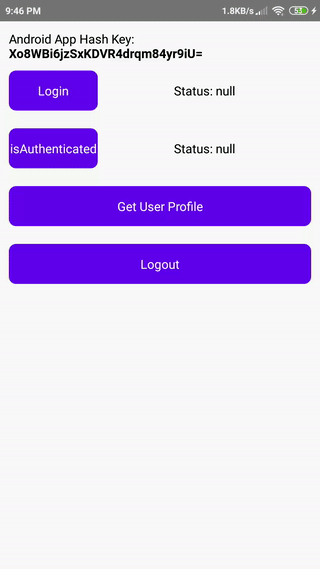

<h1 align="center">
  <div>
    
    
  </div>
  
  Zalo SDK for React Native
  <div>
  

  

  

  
  </div>
</h1>

<div align="center">
  
  
</div>

# Installation
With npm:
`$ npm install react-native-zalo-kit --save`

With yarn:
`$ yarn add react-native-zalo-kit`

# Setup
## Create Zalo Application
First of all you need to create Zalo application on [Zalo Developer Portal](https://developers.zalo.me/)

> Note: when setting up Android platform for your application, it'll ask you for a `Hash key`. We provide you a helper function to [get that key](#get-application-hash-key-android-only)

After that you'll get your Zalo App Key, and you'll need to use it for next sections

## iOS
Run the following command to setup for iOS:
```
cd ios && pod install
```

After that, open `ios/<your_app_name>/AppDelegate.m`, and add the following:
```objc
#import <ZaloSDK/ZaloSDK.h>

- (BOOL)application:(UIApplication *)application
 didFinishLaunchingWithOptions:(NSDictionary *)launchOptions {
    ...

    [[ZaloSDK sharedInstance] initializeWithAppId:@"<YOUR_ZALO_APP_ID>"];
    return YES;
}

...  

- (BOOL)application:(UIApplication *)application openURL:(nonnull NSURL *)url options:(nonnull NSDictionary<NSString *,id> *)options {
  return [[ZDKApplicationDelegate sharedInstance] application:application openURL:url options:options];
}
```
## Android
1. Open `android/build.gradle`, and change the `minSdkVersion` to 18:
```
buildscript {
    ext {
      ...

      minSdkVersion = 18
    }

    ...
```
2. Open `android/app/src/main/java/<your_app_package>/MainActivity.java`, and add the following:
```java
import com.zing.zalo.zalosdk.oauth.ZaloSDK;

public class MainActivity extends ReactActivity {
  ...

  // override method below (create it if not exist)
  @Override
  public void onActivityResult(int requestCode, int resultCode, Intent data) {
    super.onActivityResult(requestCode, resultCode, data);
    ZaloSDK.Instance.onActivityResult(this, requestCode, resultCode, data);
  }
}
```

3. After that, open `android/app/src/main/java/<your_app_package>/MainApplication.java`, and add the following:
```java
import com.zing.zalo.zalosdk.oauth.ZaloSDKApplication;

public class MainApplication extends Application implements ReactApplication {
  ...

  @Override
  public void onCreate() {
    ...

    ZaloSDKApplication.wrap(this);
  }
}
```

4. Add `appID` to `android/app/src/main/res/values/strings.xml`
```xml
<resources>
    <string name="app_name">App Name</string>
    <string name="appID"><YOUR_ZALO_APP_ID></string>
</res>
```

5. Add the following to:
```xml
<application>

  ...

  <meta-data
    android:name="com.zing.zalo.zalosdk.appID"
    android:value="@string/appID" />

  <activity
    android:name="com.zing.zalo.zalosdk.oauth.BrowserLoginActivity">
    <intent-filter>
      <action android:name="android.intent.action.VIEW" />
      <category android:name="android.intent.category.DEFAULT" />
      <category android:name="android.intent.category.BROWSABLE" />
      <data android:scheme="zalo-<YOUR_ZALO_APP_ID>" />
      <!-- eg: <data android:scheme="zalo-1234567890" />-->
    </intent-filter>
  </activity>
</application>
```
# Usage
You can import the whole library like:
```js
import ZaloKit from 'react-native-zalo-kit'

// Usage:
ZaloKit.login()
...
```
Or you can just import the module you need like:
```js
import { login } from 'react-native-zalo-kit'

// Usage
login()
```
## Login
```js
import { login, Constants } from 'react-native-zalo-kit'

const login = async () => {
  try {
    const oauthCode = await login(Constants.AUTH_VIA_APP_OR_WEB)
    console.log(oauthCode)

    /*
      returns: 'some oauthCode'
    */
  } catch (error) {
    console.log(error)
  }
}
```

`login` supports the following methods:
- `AUTH_VIA_APP_OR_WEB`: login via app or web. If user has Zalo app then login with app, otherwise using web
- `AUTH_VIA_APP`: login using Zalo app only,
- `AUTH_VIA_APP_OR_WEB`: login using Zalo web only
## Check if authenticated
```js
import { isAuthenticated } from 'react-native-zalo-kit'

const isAuthenticated = async () => {
  try {
    const isAuthenticated = await ZaloKit.isAuthenticated()
    console.log(isAuthenticated)

    /*
      returns: true | false
    */
  } catch (error) {
    console.log(error)
  }
}
```
## Get User Profile
```js
import { getUserProfile } from 'react-native-zalo-kit'

const getUserProfile = async () => {
  try {
    const userProfile = await ZaloKit.getUserProfile()
    console.log(userProfile)

    /*
      returns: {
        id: 'user_id_1',
        name: 'user name',
        phoneNumber: 'phone number',
        gender: 'male',
        birthday: '01/01/2020',
        picture: {
          data: {
            url: 'http://image.example',
          },
        }
      }
    */
  } catch (error) {
    console.log(error)
  }
}
```
## Logout
```js
import { logout } from 'react-native-zalo-kit'

const logout = () => {
  logout()
}
```
## Get Application Hash Key (Android only)
This is a helper function which returns app Hash key for Android, help you on setting up your app on [Zalo Developer Portal](https://developers.zalo.me/)
```js
import { getApplicationHashKey } from 'react-native-zalo-kit'

const getApplicationHashKey = async () => {
  try {
    const key = await getApplicationHashKey()
    console.log(key)

    /*
      returns: 'application hash key'
    */
  } catch (error) {
    console.log(error)
  }
}
```
## Get friend list used app
This API is to get friends who have used Zalo app
```js
import { getFriendListUsedApp } from 'react-native-zalo-kit'

const getFriendListUsedApp = async () => {
  try {
    const position = 0 // position we start from
    const count = 10 // number of records per page
    const friends = await getFriendListUsedApp(position, count)
    console.log(friends)

    /*
      returns: {
        data: [
          {
            id: 'user_id_1',
            name: 'user name',
            phoneNumber: 'phone number',
            gender: 'male',
            birthday: '01/01/2020',
            picture: {
              data: {
                url: 'http://image.example',
              },
            }
          }
        ],
        paging: {},
        summary: {
          total_count: number,
        }
      }
    */
  } catch (error) {
    console.log(error)
  }
}
```
## Get invitable friend list
This API is to get friends who we can invite to use Zalo app
```js
import { getFriendListInvitable } from 'react-native-zalo-kit'

const getFriendListInvitable = async () => {
  try {
    const position = 0 // position we start from
    const count = 10 // number of records per page
    const friends = await getFriendListInvitable(position, count)
    console.log(friends)

    /*
      returns: {
        data: [
          {
            id: 'user_id_1',
            name: 'user name',
            phoneNumber: 'phone number',
            gender: 'male',
            birthday: '01/01/2020',
            picture: {
              data: {
                url: 'http://image.example',
              },
            }
          }
        ],
        paging: {},
        summary: {
          total_count: number,
        }
      }
    */
  } catch (error) {
    console.log(error)
  }
}
```
## Post to user's feed
```js
import { postToWall } from 'react-native-zalo-kit'

const postToWall = async () => {
  try {
    const link = 'https://zing.vn'
    const message = 'Hello World'
    const data = await postToWall(link, message)
    console.log(data)
    
    /*
      returns: {
        id: 'post_id'
      }
    */
  } catch (error) {
    console.log(error.message)
  }
}
```
## Send message to friend
```js
import { sendMessageToFriend } from 'react-native-zalo-kit'

const sendMessageToFriend = async () => {
  try {
    const friendId = 'friend_ID'
    const link = 'https://zing.vn'
    const message = 'Hello World'
    const data = await sendMessageToFriend(friendId, link, message)
    console.log(data)

    /*
      returns: {
        to: 'friend_ID'
      }
    */
  } catch (error) {
    console.log(error)
  }
}
```
## Invite friend to use Zalo app
```js
import { inviteFriendUseApp } from 'react-native-zalo-kit'

const inviteFriendUseApp = async () => {
  try {
    const friendIds = ['friend_ID1', 'friend_ID2']
    const message = 'Hello World'
    const data = await inviteFriendUseApp(friendIds, message)
    console.log(data)

    /*
      returns: {
        to: [
          'friend_ID1', 'friend_ID2'
        ]
      }
    */
  } catch (error) {
    console.log(error)
  }
}
```
## Share link to friend
This API is to share a link to a friend by sending a message which contains the link
```js
import { sendMessageToFriendByApp } from 'react-native-zalo-kit'

const sendMessageToFriendByApp = async () => {
  try {
    const feedData = {
      appName: 'DEMO RN APP',
      message: 'Hello World',
      link: 'https://zing.vn',
      linkTitle: 'LINK TITLE',
      linkSource: 'LINK SOURCE',
      linkDesc: 'LINK DESC',
      linkThumb: ['https://lh3.googleusercontent.com/dr8A58cYr-Mnz6mi5QCe6_I2yaCICVV0jL7fjrzWixn89HiA4BGW-KraR7yU4JappTs'],
      others: {}
    }

    const data = await sendMessageToFriendByApp(feedData)
    console.log(data)

    /*
      returns: {
        success: true,
        data: "<raw message>",
        message: "format message",
        sendAction: 0 or 1 (0: sent, 1: cancelled)
      }
    */
  } catch (error) {
    console.log(error)
  }
}
```
## Share link to feed
This API is to share a link to user's feed
```js
import { postToWallByApp } from 'react-native-zalo-kit'

const postToWallByApp = async () => {
  try {
    const feedData = {
      appName: 'DEMO RN APP',
      message: 'Hello World',
      link: 'https://zing.vn',
      linkTitle: 'LINK TITLE',
      linkSource: 'LINK SOURCE',
      linkDesc: 'LINK DESC',
      linkThumb: ['https://lh3.googleusercontent.com/dr8A58cYr-Mnz6mi5QCe6_I2yaCICVV0jL7fjrzWixn89HiA4BGW-KraR7yU4JappTs'],
      others: {}
    }

    const data = await postToWallByApp(feedData)
    console.log(data)

    /*
      returns: {
        success: true,
        data: "<raw message>",
        message: "format message",
        sendAction: 0 or 1 (0: sent, 1: cancelled)
      }
    */
  } catch (error) {
    console.log(error)
  }
}
```
# Troubleshooting
1. Android: `the parameter pkg_name and sign_key are required`

This error happens because of your configuration on [Zalo Developer Portal](https://developers.zalo.me/) for Android is not correct, review your setup and make sure they're correct:
- Check your package name
- Check your Application Hash Key: you can use the function [getApplicationHashKey](#get-application-hash-key-android-only) to check the key of your app.